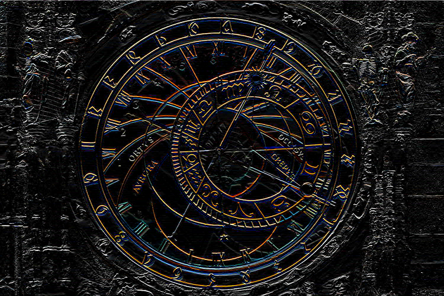

# ConvolutionGPU
`Convolution` is a mathematical operation that combines two functions to produce a third function, representing how one function modifies or affects another. It is widely used in various fields, including signal processing, image processing, and deep learning.

This header file defines the necessary structures and functions to perform `2D discrete convolution` on matrices using `CUDA` for parallel processing. It includes a matrix class template for managing 2D data and functions for performing convolution and other related operations.
Take a look at [Convolution](https://en.wikipedia.org/wiki/Convolution) and [Kernel](https://en.wikipedia.org/wiki/Kernel_(image_processing)).

> [!IMPORTANT] 
This tool is optimized for very big matrices, as the use of CUDA may introduce significant overhead for smaller datasets.

The general expression of a discrete 2D convolution is defined as:

$$
g(x, y) = \omega \ast f(x, y) = \sum_{i=-a}^{a} \sum_{j=-b}^{b} \omega(i, j) f(x - i, y - j),
$$

where $g(x, y)$ is the filtered image, $f(x, y)$ is the original image, and $\omega$ is the filter kernel. Every element of the filter kernel is considered within the range $-a \leq i \leq a$ and $-b \leq j \leq b$.

## Image processing
Take a look at the function `applyFilter` in `test/main.cu`

```c++
void applyFilter(const std::string& path, const std::string& output, const cnv::Kernel& kernel);
```

### Original


## Laplacian


### Sharpen filter


### Sobel filter

